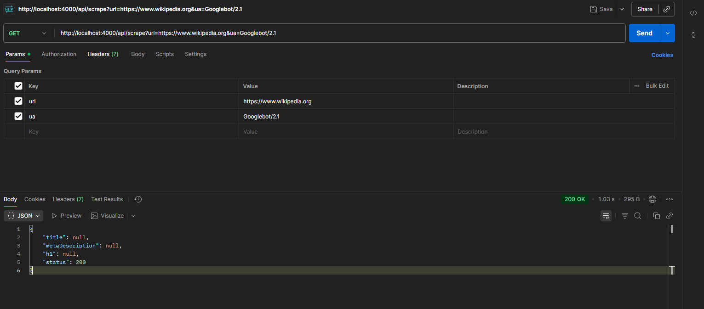
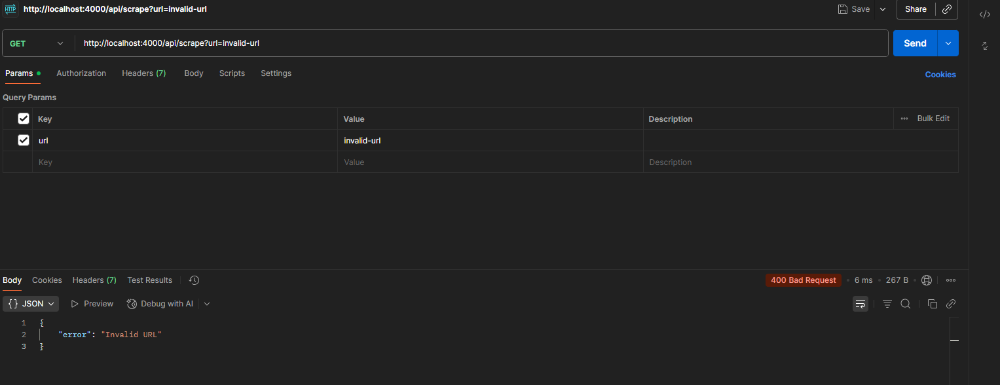
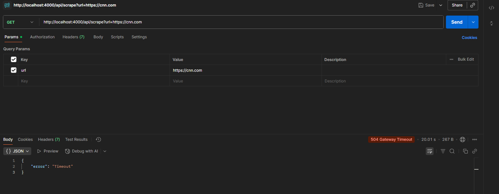

# 🧠 Micro Scraper API

A lightweight, production-style microservice that extracts structured SEO data from any webpage using **Express.js** and **Playwright (Headless Chromium)**.  
Built for reliability, clarity, and robust timeout/error management — ideal for evaluating scraping logic and backend design skills.

## 📱 Screenshots

### Success


### User Agent


### Failed


### Timeout


---

## 🚀 Features
- 🧾 Extracts page **title**, **meta description**, and **first h1** element
- ⏱ **20-second global timeout** with graceful failure handling
- 🧰 Works in **headless mode** (no GUI/browser setup needed)
- 🧩 Bonus:
  - Supports **custom User-Agent** override via `?ua=...`
  - Includes **single retry** for transient navigation errors
- 🧠 Clean TypeScript structure with modular routing and utilities

---

## 🧩 Tech Stack
- **Runtime:** Node.js + Express  
- **Language:** TypeScript  
- **Scraper Engine:** Playwright (Chromium headless)  
- **Environment:** Fully headless (no GUI, no extra setup)

---

## ⚙️ Quick Setup

Clone the repository and start the server locally:

```bash
git clone https://github.com/bagindaisfa/spiralyze-task-b.git
cd spiralyze-task-b
npm install
npm run dev
```

---

## 📡 Endpoint

```bash
GET /api/scrape?url=<target-url>&ua=<optional-user-agent>
```

👨‍💻 Author

M Baginda Isfa Pulungan
📧 [bagindaisfa05@gmail.com](mailto:bagindaisfa05@gmail.com)
💼 GitHub Profile
[https://github.com/bagindaisfa](https://github.com/bagindaisfa)